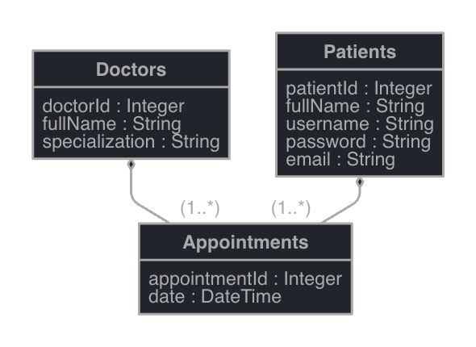

# Final - Gestor de turnos

## Arquitectura

## ERD

## Descripcion

### Cliente

El cliente acepta peticiones desde la linea de comandos. [-- operacion] indica la operación [get_appointments, confirm_appointment, cancel_appointment]

[-- operacion] Operaciones: 
- get_appointments: --from_date --to_date --doctor_name --specialization
- confirm_appointment: --doctor_name --date
- get_my_appointments: --email
- cancel_appointment: --appointment_id

Envía al servidor la operacion al servidor, que se encarga de procesar la operacion seleccionada.

### Servidor
Lee los argumentos enviados desde el cliente, y ejecuta la funcion especficia para atender la petiticion.

Se utilizan sockets para aceptar las conexiones. Se crea un thread por conexion, utilizando un ThreadPool.

Mutex para evitar race conditions

