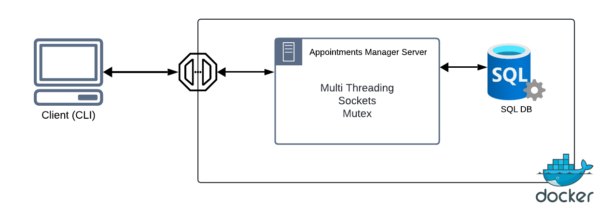

# Sistema de gestión de turnos Médicos

## Descripción General de la Aplicación
El appointments manager o sistema de gestión de turnos es una aplicación tipo cliente-servidor diseñada para manejar el proceso de reservación, confirmación y cancelación de turnos médicos. Esta aplicación permite a los usuarios iniciar sesión utilizando sus credenciales, ver citas disponibles, confirmar citas, ver citas específicas del paciente y cancelar citas existentes.

**Funcionalidades Principales**

- Log-in: Los usuarios pueden iniciar sesión con su correo electrónico y contraseña.
- Visualización de Citas: Los usuarios pueden consultar citas disponibles y sus detalles.
- Confirmación de Citas: Permite a los pacientes confirmar sus citas.
- Visualización de Citas por Paciente: Los pacientes pueden ver todas sus citas programadas.
- Cancelación de Citas: Permite a los usuarios cancelar citas que ya no necesitan.

### Tecnologías Utilizadas
La aplicación utiliza `Python` como lenguaje principal de programación con sockets para la comunicación entre el cliente y el servidor. Se usan `sockets` para manejar múltiples conexiones simultáneas, permitiendo que varios usuarios interactúen con el servidor al mismo tiempo. Para manejar estas conexiones concurrentes, se implementa un `ThreadPoolExecutor` que genera un hilo por cada cliente conectado, asegurando así una gestión eficiente de los recursos del servidor.

Para la gestión de la autenticación y las sesiones, se utiliza `JWT` (JSON Web Tokens) y `Redis` como almacén de datos en memoria. La sincronización en operaciones que modifican datos compartidos, como las confirmaciones o cancelaciones de citas, se maneja mediante `Locks` para asegurar la exclusión mutua y prevenir condiciones de carrera, garantizando la integridad de los datos en la base de datos `SQL` que facilita la interacción con los datos relacionados a citas y usuarios.

## Arquitectura
